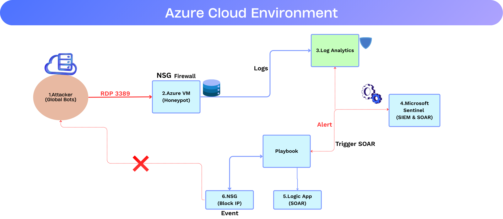
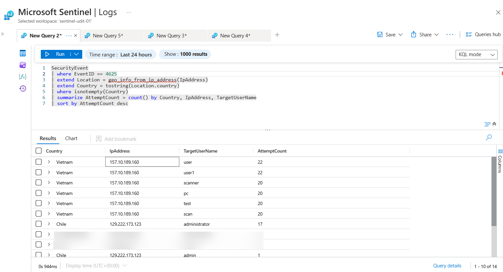

# Sentin-Shield: Automated Cloud SOC & Honeypot

## 🚀 Overview
Sentin-Shield is a cloud-native Security Operations Center (SOC) project designed to observe, analyze, and automatically mitigate real-time brute-force attacks. By deploying a Windows-based Honeypot in Azure, I monitored global threat actors and implemented an automated response (SOAR) using Microsoft Sentinel and Logic Apps.

### 🛠️ Technologies Used
* **Cloud:** Microsoft Azure
* **SIEM/SOAR:** Microsoft Sentinel
* **Automation:** Azure Logic Apps
* **Firewall:** Network Security Group (NSG)
* **Query Language:** KQL (Kusto Query Language)
* **Threat Intel:** Shodan, IP Reputation DBs

---



🏗️ Architecture Breakdown
Attack Ingress: The journey begins with automated botnets (primarily from Vietnam/Chile) targeting the Windows Honeypot via RDP (Port 3389).

Log Ingestion: Every failed login attempt is captured as a Security Event (Event ID 4625) and streamed in real-time to the Azure Log Analytics Workspace.

Threat Detection: Microsoft Sentinel monitors these logs using a custom KQL (Kusto Query Language) analytics rule. If an IP exceeds 50 failed attempts within 5 minutes, a High-Severity Incident is triggered.

SOAR Automation: Upon incident creation, a Logic App (Playbook) is automatically invoked. It extracts the malicious IP Entity from the alert metadata.

Automated Remediation: The Logic App pushes a command to the Network Security Group (NSG) to create a high-priority "DENY" rule for that specific IP, effectively neutralizing the threat without human intervention.

---

## 🔍 Phase 1: The Honeypot & Attack Observation
I deployed a Windows VM with an exposed RDP port to attract automated botnets. Within minutes, the VM was discovered and targeted.

### Key Observation: The Vietnam Spike
Using KQL, I identified a massive brute-force escalation.
* **Total Attempts:** 400+ Failed Logons.
* **Top Attacker Origin:** Vietnam / Chile.
* **Tactic:** High-frequency dictionary attacks on the `Administrator` and `Test` accounts.

### 📊 Attack Observation


### 📊 Log Record


### ⚡ Automation (Logic App)


```kql
// KQL to visualize the attack
SecurityEvent
| where EventID == 4625
| extend Country = tostring(geo_info_from_ip_address(IpAddress).country)
| summarize AttemptCount = count() by Country
| sort by AttemptCount desc
